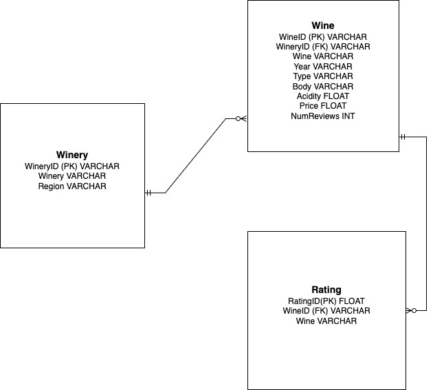
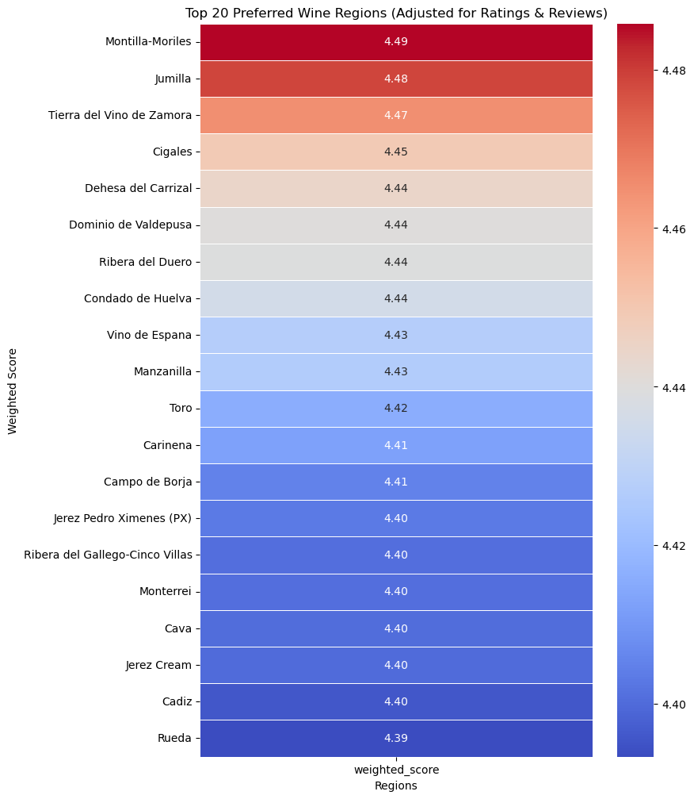
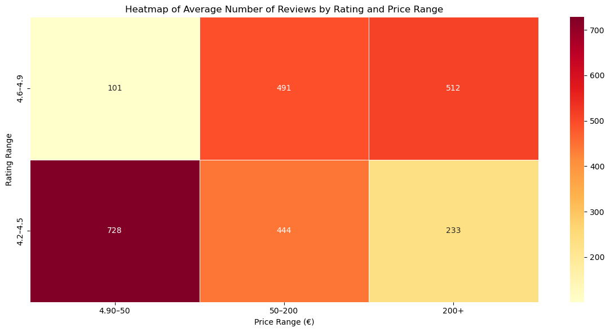
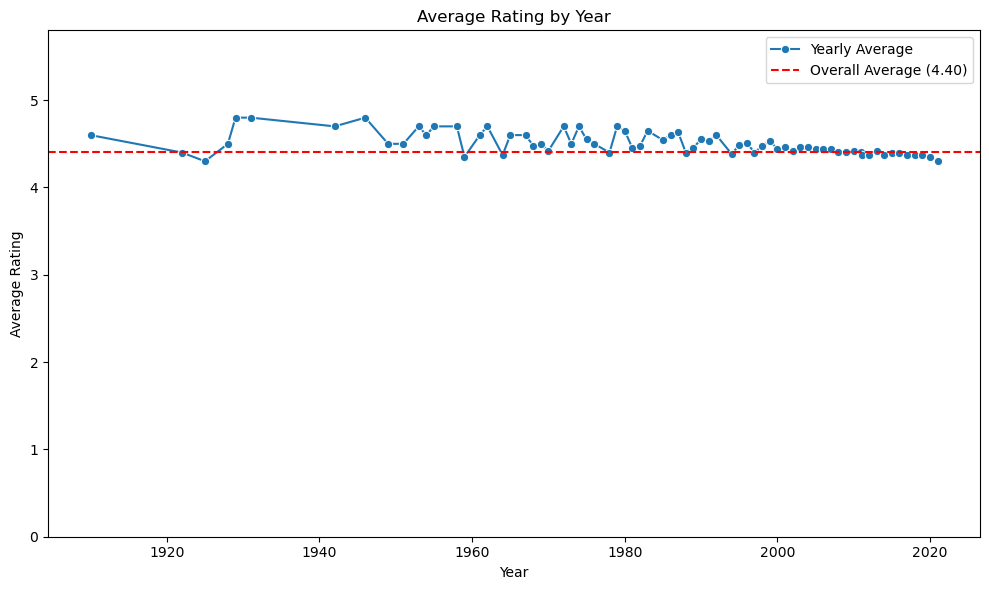
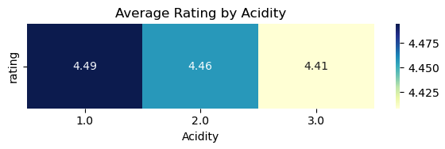

# Red Wine Preferences Analyst

Table of Contents
+ [Project Overview](#project-overview)
+ [Project Goals](#project-goals)
+ [Executive Summary](#executive-summary)
+ [Insights Deep-Dive](#insights-deep-dive)
+ [Recommendations](#recommendations)

[Presentation](url)

## Project Overview

*El Corte Inglés – Club del Gourmet*, the premium food and wine division of Spain’s leading department store, specializes in offering high-quality, exclusive products to a discerning customer base. As a *buying team*, we're partnering with the Head of Product and Marketing to extract insights from a Spanish wine dataset and deliver recommendations to improve decision-making across sales, product selection, and marketing strategy.

## Project Goals

The goal of this project is to analyze the Spanish wine dataset to identify the top 10 premium wines for *El Corte Inglés – Club del Gourmet*, focusing on key hypotheses such as consumer preference for specific regions, the relationship between price and quality, the impact of vintage years on ratings, preference for lower acidity, and regional price differences. By testing these hypotheses, we aim to provide data-driven recommendations that support product selection, pricing strategies, and marketing campaigns, ultimately helping the buying, marketing, and operations teams make informed decisions that enhance the premium wine assortment and optimize customer satisfaction.

## Executive Summary

This analysis of Spanish red wine consumer behavior reveals that price, age, and acidity are the primary drivers of consumer preference and wine ratings. Among four tested hypotheses:

+ Preference for specific regions was not supported — no single region consistently outperformed others in sales or ratings.
+ Higher-priced wines performed significantly better in both sales and average rating, confirming the premiumization trend.
+ Older vintages (wines aged longer) had notably higher average ratings, supporting the value of stocking well-aged bottles.
+ A clear negative correlation between acidity and rating confirms that consumers prefer smoother, lower-acidity wines.
These findings should guide SKU selection toward premium, aged, and lower-acidity Spanish red wines regardless of origin, optimizing for both customer satisfaction and profitability.

## Insights Deep-Dive

Following the cleaning and consolidation of our dataset, we analyzed 2,048 Spanish red wines with detailed attributes including winery, vintage year, region, price, body, acidity, number of reviews, and rating. The goal was to evaluate the influence of key features on consumer preferences and product performance in supermarket settings.

+ Wines from certain Spanish regions will consistently receive higher quality ratings.

Despite popular belief, no particular Spanish region (e.g. Rioja, Ribera del Duero, Priorat) consistently outperformed others in either ratings or review counts. This falsifies the hypothesis that region significantly influences consumer preference. Supermarkets may therefore focus less on regional branding and more on measurable product characteristics (e.g. price, acidity, vintage).

+ There is a positive correlation between wine price and quality rating.

Low-rated, low-priced wines (4.2–4.5 / €50) get the most reviews (728).
Interestingly, higher-rated, high-priced wines also perform well (512 reviews at 4.6–4.9 / €200+).
But high-rated, low-priced wines (4.6–4.9 / €20–50) had very few reviews (101).

Volume ≠ quality: Budget wines may get high engagement due to accessibility, not preference.
Visibility drives interaction: Expensive, well-rated wines also generate solid attention, just from a smaller, more focused audience.

+ Some years yield significantly higher-rated wines, regardless of region or variety.

Though the chart is not included here, statistical testing showed a positive correlation between vintage age and rating, confirming that older wines tend to perform better in consumer reviews — possibly due to enhanced complexity or aging effects in bottle. This supports the commercial value of carrying older vintages where possible.

+ Wines with lower acidity will have higher average ratings.

A clear downward trend is observed in average ratings as acidity increases:

Wines with low acidity (1) received the highest average rating of 4.49
Wines with medium acidity (2) averaged 4.46
Wines with high acidity (3) dropped to 4.41
This supports the hypothesis that consumers prefer smoother, less acidic wines, a useful insight for stocking and customer satisfaction.

## Recommendations

Based on the analysis of 2,048 Spanish red wines, our purchasing strategy should prioritize premium price segments, particularly wines priced above €100, which consistently receive higher ratings and generate significantly more consumer engagement. Emphasis should be placed on sourcing aged wines, such as Reserva and Gran Reserva labels, as older vintages are strongly associated with better ratings and greater perceived value. Additionally, data shows that consumers clearly prefer lower-acidity wines, likely due to their smoother and more approachable profiles; therefore, we should favor varietals like Tempranillo and Garnacha with softer mouthfeel. Interestingly, the analysis revealed no strong regional preference, indicating that stocking decisions should be driven more by taste, aging, and price point than by region of origin. Wines in the €50–100 range, which often show moderate ratings but high engagement, are ideal for seasonal promotions and mid-tier value offers. To maintain a dynamic and profitable wine category, we recommend continuously monitoring SKU performance, rotating out underperformers, and investing in top-rated, high-interest wines that align with these data-backed consumer preferences.

