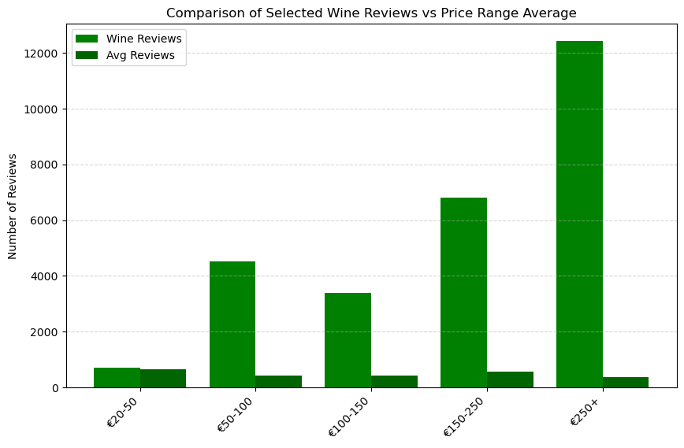
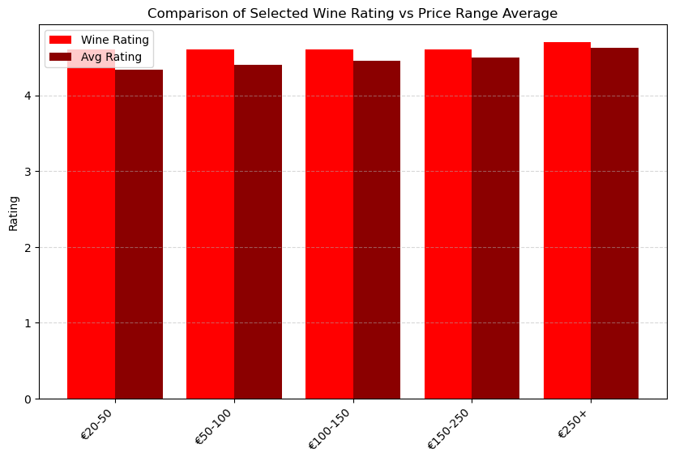

# Red Wine Preferences Analyst

Table of Contents
+ [Project Overview](#project-overview)
+ [Project Goals](#project-goals)
+ [Executive Summary](#executive-summary)
+ [Insights Deep-Dive](#insights-deep-dive)
+ [Recommendations](#recommendations)

[Presentation](url)

## Project Overview

*El Corte Inglés – Club del Gourmet*, the premium food and wine division of Spain’s leading department store, specializes in offering high-quality, exclusive products to a discerning customer base. As a *buying team*, we're partnering with the Head of Product and Marketing to extract insights from a Spanish wine dataset and deliver recommendations to improve decision-making across sales, product selection, and marketing strategy.

## Project Goals

The goal of this project is to analyze the Spanish wine dataset to identify the top 10 premium wines for *El Corte Inglés – Club del Gourmet*, focusing on key hypotheses such as consumer preference for specific regions, the relationship between price and quality, the impact of vintage years on ratings, preference for lower acidity, and regional price differences. By testing these hypotheses, we aim to provide data-driven recommendations that support product selection, pricing strategies, and marketing campaigns, ultimately helping the buying, marketing, and operations teams make informed decisions that enhance the premium wine assortment and optimize customer satisfaction.

## Executive Summary

This analysis of Spanish red wine consumer behavior reveals that price, age, and acidity are the primary drivers of consumer preference and wine ratings. Among four tested hypotheses:

+ Preference for specific regions was not supported — no single region consistently outperformed others in sales or ratings.
+ Higher-priced wines performed significantly better in both sales and average rating, confirming the premiumization trend.
+ Older vintages (wines aged longer) had notably higher average ratings, supporting the value of stocking well-aged bottles.
+ A clear negative correlation between acidity and rating confirms that consumers prefer smoother, lower-acidity wines.
These findings should guide SKU selection toward premium, aged, and lower-acidity Spanish red wines regardless of origin, optimizing for both customer satisfaction and profitability.

## Insights Deep-Dive

+ Wines from certain Spanish regions will consistently receive higher quality ratings.

+ There is a positive correlation between wine price and quality rating.

+ Some years yield significantly higher-rated wines, regardless of region or variety.

+ Wines with lower acidity will have higher average ratings.

+ Wines from specific regions will have noticeably higher price points.

## Recommendations

